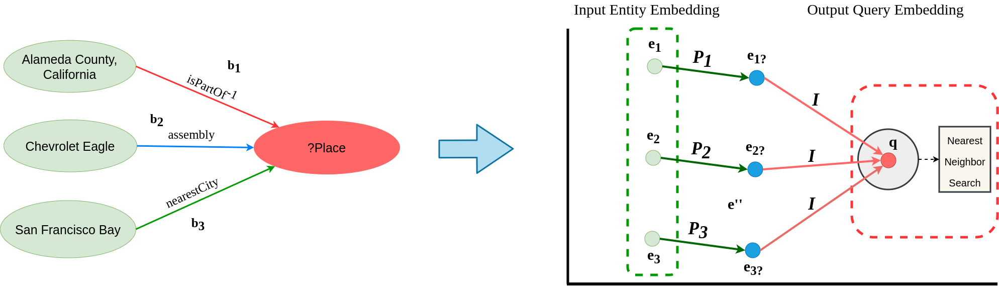
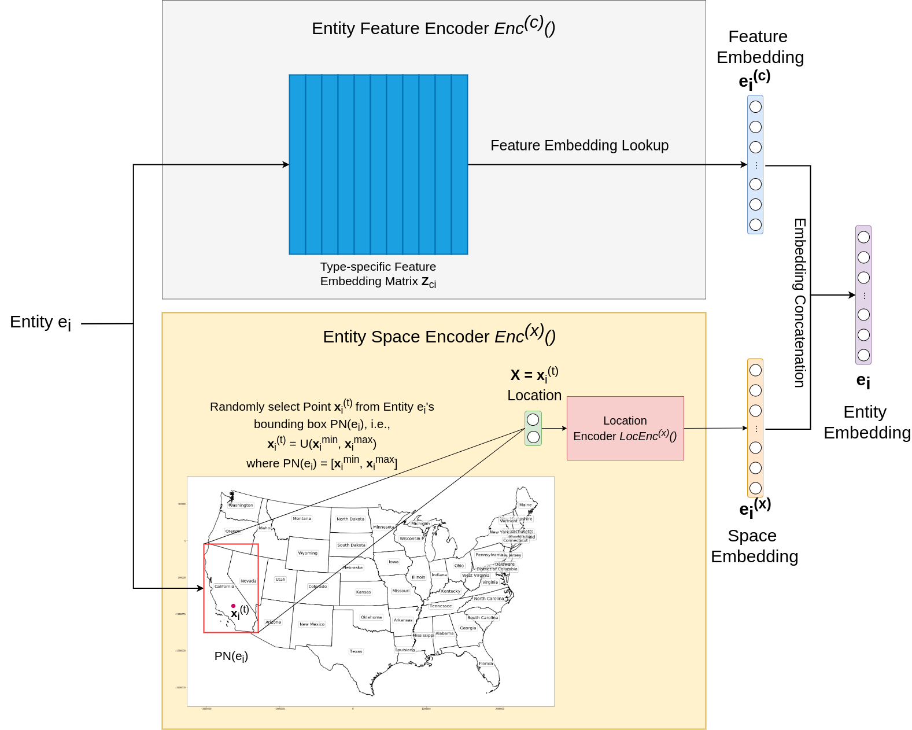
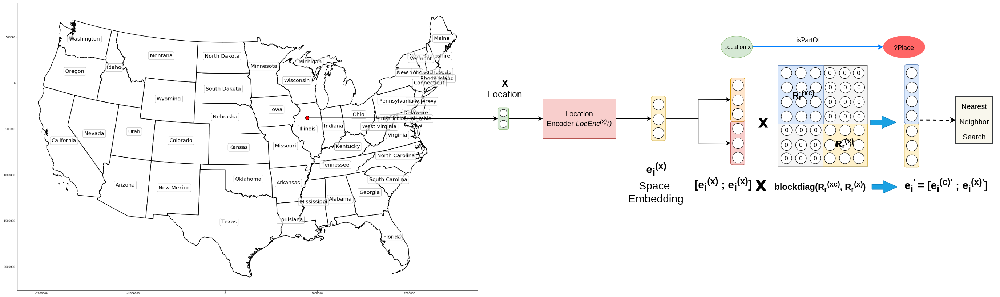

# Geographic Question Answering based on Knowledge Graph Embedding Techniques

Code for recreating the results in [our Transactions in GIS paper](https://onlinelibrary.wiley.com/doi/full/10.1111/tgis.12629) as well as [our K-CAP 2019 paper](https://dl.acm.org/doi/10.1145/3360901.3364432) .

## [SE‐KGE : A location‐Aware Knowledge Graph Embedding Model for Geographic Question Answering and Spatial Semantic Lifting](https://onlinelibrary.wiley.com/doi/full/10.1111/tgis.12629)

### Related Link
1. [Transactions in GIS Paper](https://onlinelibrary.wiley.com/doi/full/10.1111/tgis.12629)
2. [Arxiv Paper](https://arxiv.org/abs/2004.14171)
3. [Esri UC 2020 Presentation](https://youtu.be/UO4wKnLPmDgE)
4. [Esri UC 2020 Presentation Slides](http://www.geog.ucsb.edu/~gengchen_mai/presentations/2020-EsriUC2020-Pos_Enc_QA.pdf)

## [Contextual Graph Attention for Answering Logical Queries over Incomplete Knowledge Graphs](https://dl.acm.org/doi/10.1145/3360901.3364432)


### Related Link
1. [K-CAP 2019 Paper](https://dl.acm.org/doi/10.1145/3360901.3364432)
2. [Arxiv Paper](https://arxiv.org/abs/1910.00084)
3. [K-CAP 2019 Presentation Slides](http://www.geog.ucsb.edu/~gengchen_mai/presentations/2019-K-CAP2019.pdf)

Please visit [my Homepage](http://www.geog.ucsb.edu/~gengchen_mai/) for more information.


## Model Archtecture

### Geographic Question Answering
<p align="center">
  
</p>

The location-aware entity encoder architecture:
<p align="center">
  
</p>

### Spatial Semantic Lifting
<p align="center">
  
</p>


## Dependencies
- Python 2.7+
- Torch 1.0.1+
- numpy 1.16.0+
- matplotlib 2.2.4+
- sklearn 0.20.3+
- geopandas 0.6.1+
- shapely 1.6.4+
- pyproj 2.2.2+

To set up the code , run `python setup.py`. Note that the first three are required for model training and testing. The rest are used for visualization which is optional.

## Data
You can download the GeoQA dataset from [here](https://drive.google.com/file/d/1hbaw16RuSw3HGzhWxFReqWPbLXEs1GAJ/view?usp=sharing). Unextract it and put them in `graphqa/dbgeo/`.


## Code Usage
This code is implemented in Python 2.7. All codes are in `graphqa/netquery/`.

### Geographic Question Answering
For each baseline in Table 3:
1. `GQE_{diag}`: run `graphqa/dbgeo_geoqa_gqe.sh`;
2. `GQE`: run `graphqa/dbgeo_geoqa_gqe_diag.sh`;
3. `CGA`: run `graphqa/dbgeo_geoqa_cga.sh`;
4. `SE-KGE_{direct}`: run `graphqa/dbgeo_geoqa_direct.sh`;
5. `SE-KGE_{pt}`: run `graphqa/dbgeo_geoqa_direct.sh`;
6. `SE-KGE_{space}`: run `graphqa/dbgeo_geoqa_space.sh`;
7. `SE-KGE_{full}`: run `graphqa/dbgeo_geoqa_full.sh`.


### Spatial Semantic Lifting
For each baseline in Table 5:
1. `SE-KGE_{space}`: run `graphqa/dbgeo_spa_sem_lift_space.sh`;
2. `SE-KGE_{ssl}`: run `graphqa/dbgeo_spa_sem_lift_ssl.sh`.


## Reference
If you find our work useful in your research please consider citing our paper.  
```
@article{mai2020se,
  title={{SE}-{KGE}: A Location-Aware Knowledge Graph Embedding Model for Geographic Question Answering and Spatial Semantic Lifting},
  author={Mai, Gengchen and Janowicz, Krzysztof and Cai, Ling and Zhu, Rui and Regalia, Blake and Yan, Bo and Shi, Meilin and Lao, Ni},
  journal={Transactions in GIS},
  year={2020},
  doi={10.1111/tgis.12629}
}

@inproceedings{mai2019contextual,
  title={Contextual Graph Attention for Answering Logical Queries over Incomplete Knowledge Graphs},
  author={Mai, Gengchen and Janowicz, Krzysztof and Yan, Bo and Zhu, Rui and Cai, Ling and Lao, Ni},
  booktitle={Proceedings of the 10th International Conference on Knowledge Capture},
  pages={171--178},
  year={2019}
}
```

The location encoder component in SE-KGE model is based on [Space2Vec](https://github.com/gengchenmai/space2vec). Read [our ICLR 2020 paper](https://openreview.net/forum?id=rJljdh4KDH) for a comprehensive understanding:
```
@inproceedings{space2vec_iclr2020,
  title={Multi-Scale Representation Learning for Spatial Feature Distributions using Grid Cells},
  author={Mai, Gengchen and Janowicz, Krzysztof and Yan, Bo and Zhu, Rui and  Cai, Ling and Lao, Ni},
  booktitle={The Eighth International Conference on Learning Representations},
  year={2020},
  organization={openreview}
}
```


Note that a part of our code is based on the [code](https://github.com/williamleif/graphqembed) of [Hamilton et al's NIPS 2018 paper](https://papers.nips.cc/paper/7473-embedding-logical-queries-on-knowledge-graphs.pdf):
```
@inproceedings{hamilton2018embedding,
  title={Embedding logical queries on knowledge graphs},
  author={Hamilton, Will and Bajaj, Payal and Zitnik, Marinka and Jurafsky, Dan and Leskovec, Jure},
  booktitle={Advances in Neural Information Processing Systems},
  pages={2026--2037},
  year={2018}
}
```